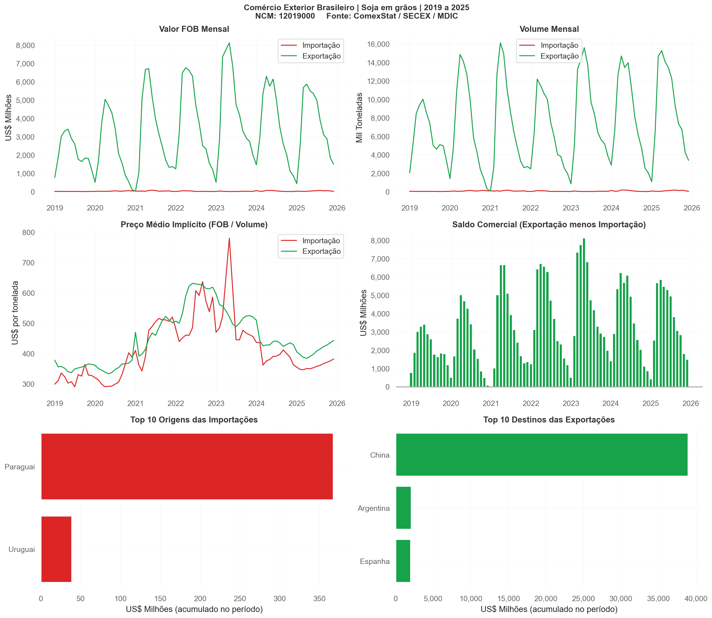

# Brazil Trade Data Collector — Comexstat

A data pipeline and dashboard for Brazil's official export and import statistics, powered by the ComexStat API.

---

## The Problem

Brazil's foreign trade data is published by the Ministry of Economy (MDIC/SECEX) through the ComexStat platform. Analyzing specific commodities — monthly trends, price evolution, trade partners — requires either manual downloads or building custom API calls. This tool wraps the full pipeline: API query → data processing → statistical summary → 6-panel dashboard, for any product defined by its NCM code.

---

## How It Works

### 1. API query
Queries the ComexStat REST API (`api-comexstat.mdic.gov.br`) for a user-defined product (NCM code) and date range. Retrieves four datasets in parallel:
- Monthly import series (total)
- Monthly export series (total)
- Cumulative imports by country of origin
- Cumulative exports by destination country

### 2. Data processing
- Converts FOB values (US$) and weight (kg) from string to numeric
- Builds a proper datetime index from year + month columns
- Aggregates multiple NCMs into a single monthly series
- Calculates the **implicit price** (FOB ÷ volume, in US$/ton) — a proxy for the commodity's unit value over time

### 3. Statistical summary
For each trade flow (import and export), the tool prints:
- Total FOB value (US$)
- Total volume (thousand tonnes)
- Monthly average FOB
- Volume-weighted average price (US$/ton)
- Price volatility (coefficient of variation)
- Year-over-year growth (last two complete years)

### 4. Dashboard — 6 panels

| Panel | Content |
|-------|---------|
| FOB value (monthly) | Import vs. export value time series |
| Volume (monthly) | Import vs. export volume time series |
| Implicit price | FOB ÷ volume — unit value trend |
| Trade balance | Monthly surplus/deficit (exports − imports) as colored bar chart |
| Top 10 origins | Countries supplying Brazilian imports (by accumulated FOB) |
| Top 10 destinations | Countries receiving Brazilian exports (by accumulated FOB) |

---

## Outputs

- Console summary with statistics for imports and exports
- `comexstat_dashboard.png` — 6-panel dashboard saved at 150 dpi

---

## Technologies

| Package | Use |
|---------|-----|
| `requests` | ComexStat API calls (POST) |
| `pandas` | Data cleaning, aggregation, merging |
| `Matplotlib` | 6-panel dashboard |

---

## How to Run

```bash
pip install requests pandas matplotlib
python "10.02.2026 Comexstat Commodities Data Collector & Dashboard - Import & Exports.py"
```

To analyze a different product, edit `NCM_CODES` and `NOME_PRODUTO` at the top of the script. A full NCM table is available at [comexstat.mdic.gov.br](https://comexstat.mdic.gov.br).

---

## Preview


